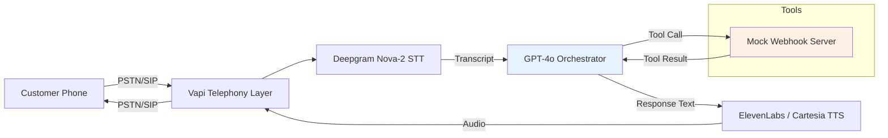
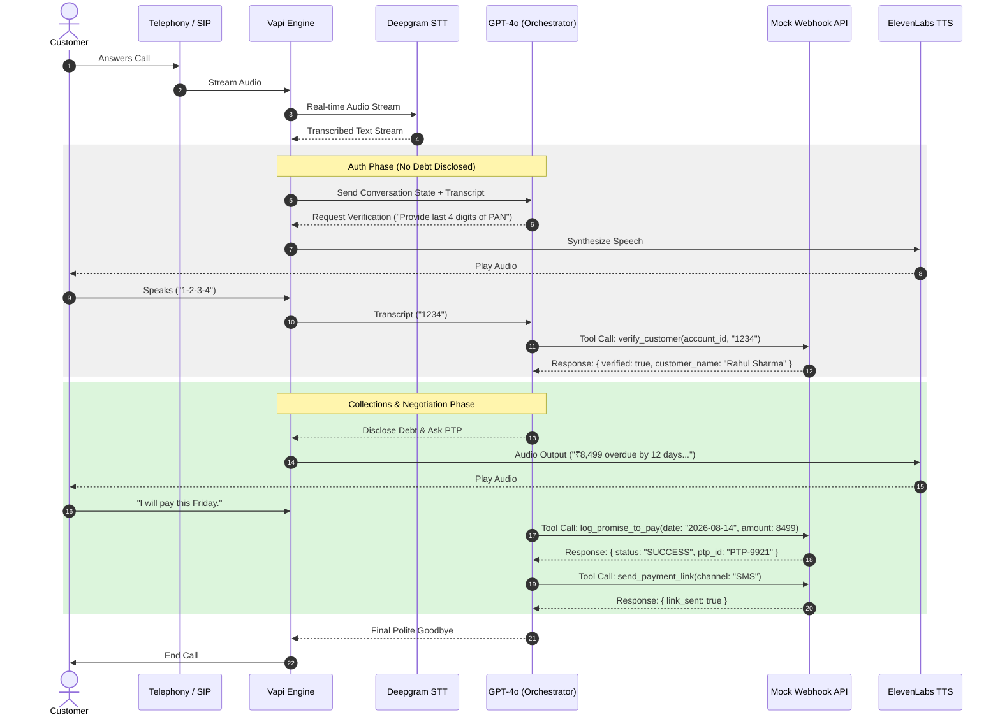
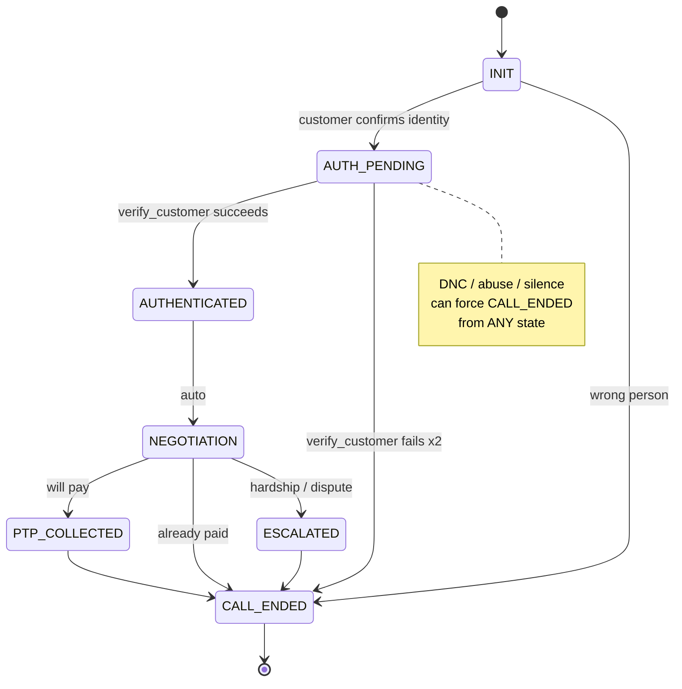

# System Architecture Diagrams

Both diagrams below are Mermaid source. To view them rendered:
- **In VS Code:** install the "Markdown Preview Mermaid Support" extension, then open this file and use `Ctrl+Shift+V` (Preview).
- **Online:** paste the code blocks into [mermaid.live](https://mermaid.live) and export as PNG for `System_Architecture.png` if you need a static image for submission.

---

## 1. Pipeline Overview

---

## 2. Full Call Sequence (Auth + Negotiation Phases)

---

## 3. State Machine

